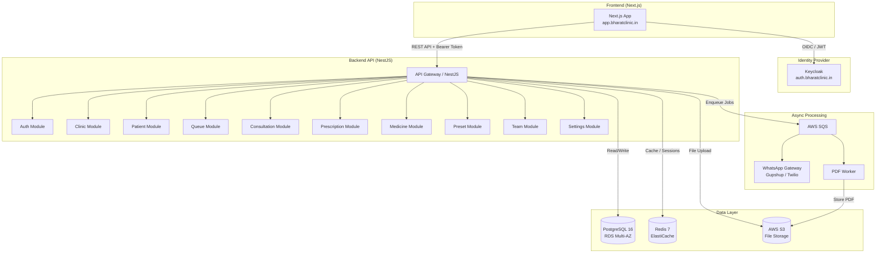
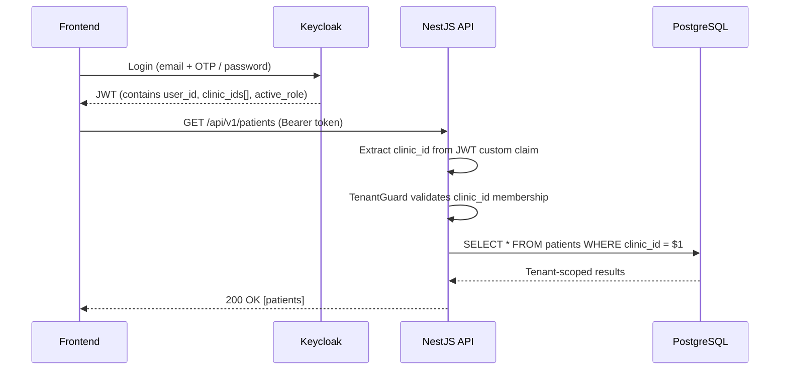
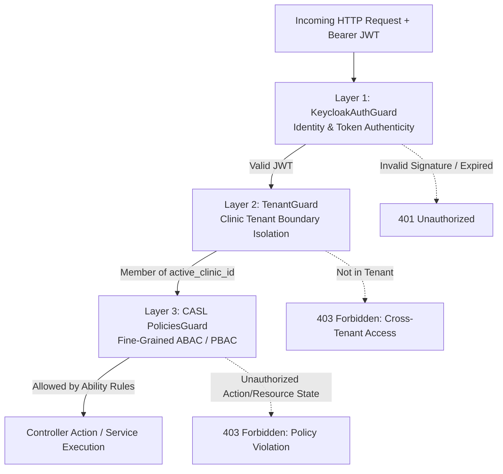
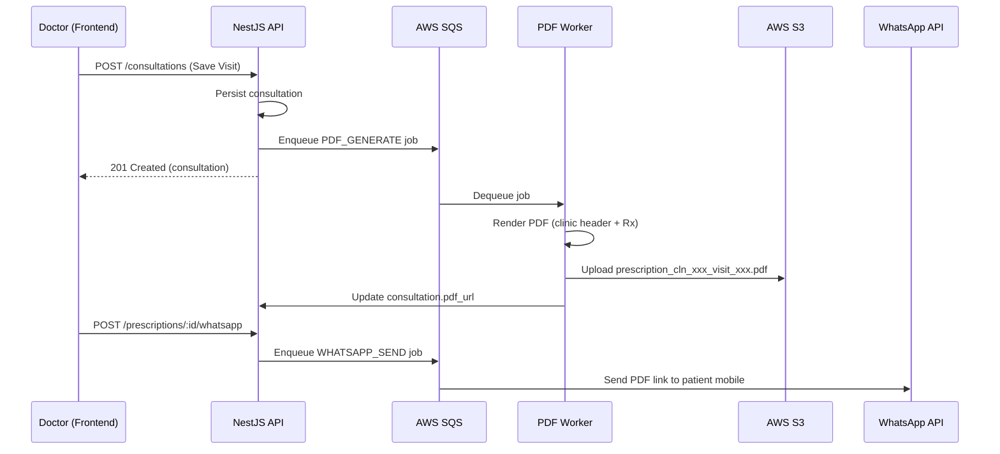
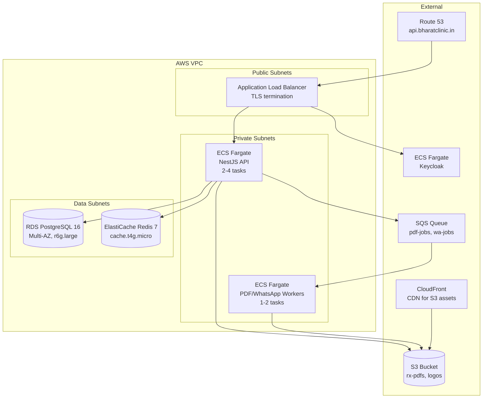
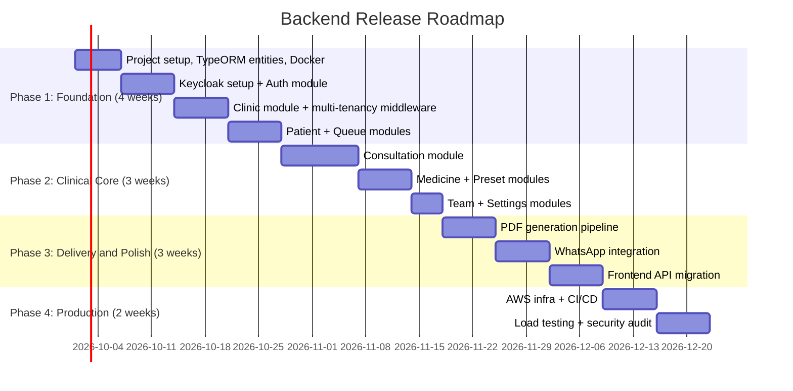

# Backend PRD — Bharat Clinic SaaS Platform

---

### Document Information

| Field                | Value                                                               |
| :------------------- | :------------------------------------------------------------------ |
| **Product Name**     | Bharat Clinic — OPD Management & Fast Consultation SaaS             |
| **Module**           | Backend API, Database, Auth, Infra                                  |
| **Version**          | 1.0.0                                                               |
| **Status**           | Ready for Implementation                                            |
| **Target Release**   | Q4 2026                                                             |
| **Primary Audience** | Backend Engineering, DevOps, Product, QA                            |
| **Frontend PRD**     | See PRD.md in project root                                          |

---

## 1. Executive Summary

### 1.1 Context

The Bharat Clinic frontend is a fully functional **demo-only** Next.js application with all state managed via `localStorage`. Every entity — clinics, patients, queue entries, consultations, prescriptions, presets, medicines, doctors, receptionists — is persisted exclusively in the browser. There is **no backend, no database, no authentication, and no API**.

### 1.2 Objective

Build a **production-grade backend** that replaces the browser-local demo stores (`clinicStore.ts`, `demoStore.ts`) with:

- A **NestJS (Node.js + TypeScript)** REST API server
- A **PostgreSQL** relational database with multi-tenant data isolation
- **Keycloak** for authentication, authorization, and RBAC
- **AWS** deployment (ECS + RDS + ElastiCache)
- PDF prescription generation and WhatsApp delivery pipeline

### 1.3 Design Principles

1. **Tenant Isolation First** — Every query, mutation, and response is scoped to the authenticated user's clinic tenant.
2. **Schema Parity** — Backend data models mirror the existing TypeScript interfaces in `lib/types/clinic.ts` to minimize frontend refactoring.
3. **Speed at Scale** — API latency budgets match the sub-60-second consultation workflow (p99 < 200ms for all CRUD endpoints).
4. **Offline-First Compatible** — Design APIs to support future optimistic UI and client-side caching (ETags, last-modified headers).

---

## 2. Technology Stack

| Layer               | Technology                        | Rationale                                                         |
| :------------------ | :-------------------------------- | :---------------------------------------------------------------- |
| **Runtime**         | Node.js 20 LTS                    | TypeScript ecosystem, shared types with Next.js frontend          |
| **Framework**       | NestJS 10+                        | Enterprise-grade DI, modular architecture, guards, interceptors   |
| **Language**        | TypeScript 5.x (strict mode)      | Type safety, shared interfaces with frontend                      |
| **Database**        | PostgreSQL 16                     | Multi-tenant SaaS standard, JSONB, full-text search, row-level security |
| **ORM**             | TypeORM 0.3+                      | Decorator-based entities, migrations, NestJS-native integration   |
| **Auth / IAM**      | Keycloak 24+                      | Enterprise SSO, coarse RBAC, realm-per-tenant, OIDC/OAuth2       |
| **Authorization**   | CASL (`@casl/ability` + `@casl/nestjs`)| Fine-grained ABAC / PBAC, resource-level policies, isomorphic with Next.js (`@casl/react`) |
| **Cache**           | Redis 7+ (ElastiCache)            | Session cache, queue state, rate limiting                         |
| **File Storage**    | AWS S3                            | Clinic logos, prescription PDFs, patient documents                |
| **PDF Generation**  | Puppeteer / `@react-pdf/renderer` | Clinic-branded prescription PDF generation                        |
| **Messaging**       | AWS SQS + SNS                     | Async prescription delivery, WhatsApp via Gupshup/Twilio          |
| **API Docs**        | Swagger / OpenAPI 3.0             | Auto-generated from NestJS decorators                             |
| **Testing**         | Jest + Supertest + Testcontainers | Unit, integration, and e2e tests with real PostgreSQL              |
| **Containerization**| Docker + Docker Compose           | Local development parity                                          |
| **CI/CD**           | GitHub Actions → AWS ECR → ECS    | Automated build, test, deploy pipeline                            |

---

## 3. Architecture Overview



---

## 4. Multi-Tenancy Strategy

### 4.1 Approach: Shared Database, Schema-Level Isolation with Row-Level Security

| Aspect              | Decision                                                                  |
| :------------------ | :------------------------------------------------------------------------ |
| **DB Architecture** | Single PostgreSQL database, single schema, `clinic_id` column on every table |
| **Isolation**       | PostgreSQL Row-Level Security (RLS) policies enforce tenant boundary      |
| **Tenant ID**       | `clinic_id` (UUID) — injected into every query via TypeORM subscriber / global scope |
| **Keycloak Mapping**| Each clinic is a Keycloak **Group**; users belong to one or more groups   |

### 4.2 Tenant Resolution Flow



### 4.3 TypeORM Tenant Subscriber & Global Scope

```typescript
// TypeORM EntitySubscriber — auto-sets clinicId on INSERT
@EventSubscriber()
export class TenantSubscriber implements EntitySubscriberInterface {
  beforeInsert(event: InsertEvent<any>) {
    const tenantId = cls.get('tenantId'); // from AsyncLocalStorage
    if (tenantId && 'clinicId' in event.entity) {
      event.entity.clinicId = tenantId;
    }
  }
}

// Base repository with automatic tenant scoping
@Injectable()
export class TenantAwareRepository<T extends { clinicId: string }> {
  constructor(
    @InjectRepository(entity) private readonly repo: Repository<T>,
    private readonly cls: ClsService,
  ) {}

  find(options?: FindManyOptions<T>): Promise<T[]> {
    return this.repo.find({
      ...options,
      where: { ...options?.where, clinicId: this.cls.get('tenantId') } as any,
    });
  }

  // ... findOne, save, update, delete all scoped similarly
}
```

---

## 5. Authentication (Keycloak) & Fine-Grained Authorization (CASL)

### 5.1 Three-Layer Security Architecture

Authorization is structured in three explicit, complementary layers:



1. **Layer 1 (Keycloak):** Validates who the user is and extracts coarse identity and roles.
2. **Layer 2 (TenantGuard & PostgreSQL RLS):** Guarantees tenant isolation (`clinic_id`), preventing any cross-clinic data leakage.
3. **Layer 3 (CASL):** Enforces in-memory, attribute- and state-dependent rules (e.g., a doctor can only modify their own active consultation; finalized prescriptions are immutable; receptionists cannot access clinical notes).

---

### 5.2 Keycloak Configuration

| Config                | Value                                      |
| :-------------------- | :----------------------------------------- |
| **Realm**             | `bharat-clinic`                            |
| **Client**            | `bharat-clinic-web` (public, PKCE)         |
| **Client**            | `bharat-clinic-api` (confidential, bearer) |
| **Identity Providers**| Email/Password + Phone OTP (custom SPI)    |
| **User Federation**   | PostgreSQL user store (via custom SPI)      |

---

### 5.3 JWT Custom Claims

```json
{
  "sub": "usr_auth_789412",
  "email": "aniket.mehta@bharatclinic.in",
  "phone": "+919876543210",
  "name": "Dr. Aniket Mehta",
  "clinic_ids": ["cln_ind_9a8b7c"],
  "active_clinic_id": "cln_ind_9a8b7c",
  "role": "CLINIC_OWNER",
  "realm_access": {
    "roles": ["CLINIC_OWNER"]
  }
}
```

---

### 5.4 CASL Fine-Grained Authorization Matrix (ABAC)

CASL (`@casl/ability`) defines permissions using **Actions**, **Subjects** (Entities), and **Conditions**:

#### Actions
- `manage`: Wildcard (all actions)
- `create`: Create new entity
- `read`: View entity
- `update`: Modify entity
- `delete`: Delete entity

#### Permission Matrix by Role

| Role | Subject | Allowed Actions | Conditions / Restrictions |
| :--- | :--- | :--- | :--- |
| **`CLINIC_OWNER`** | `all` | `manage` | Full CRUD within their active `clinic_id` (subscription, settings, team, formulary, consults). |
| **`DOCTOR`** | `Patient` | `create`, `read`, `update` | Can register and view patient demographic/history. Cannot delete patients. |
| | `Consultation` | `create`, `read` | Can create consultations and read all consultations within the clinic. |
| | `Consultation` | `update` | **Conditional:** Only if `doctorId == user.sub` AND `status != 'COMPLETED'`. |
| | `Prescription` | `create`, `read` | Can create prescriptions for linked consultations. |
| | `Prescription` | `update` | **Conditional:** Only if `isLocked == false` (cannot edit once finalized/sent). |
| | `QueueEntry` | `read`, `update` | Can view queue and call patient to consultation room. |
| | `PrescriptionPreset` | `manage` | Can create, modify, and delete personal/clinic prescription templates. |
| | `ClinicMedicine` | `read` | Can search clinic formulary. Cannot edit medicine master rates. |
| **`RECEPTIONIST`** | `Patient` | `create`, `read`, `update` | Can register patients, search, and update contact/demographics. |
| | `QueueEntry` | `manage` | Full control over check-in, token generation, priority, and queue reordering. |
| | `Consultation` | `read` | **Field-restricted:** Only status and queue metadata. **No access** to clinical diagnosis or Rx notes. |
| | `Prescription` | `none` | **Cannot** create, edit, or view prescription details. |
| | `ClinicMedicine` | `read` | Can view medicine availability. |
| **`STAFF`** | `QueueEntry`, `Patient` | `read` | Read-only access to reception TV display and queue numbers. |

---

### 5.5 CASL Implementation in NestJS

#### `casl-ability.factory.ts`
```typescript
import { AbilityBuilder, PureAbility, AbilityClass, ExtractSubjectType, InferSubjects } from '@casl/ability';
import { Injectable } from '@nestjs/common';
import { Patient } from '../modules/patient/entities/patient.entity';
import { Consultation } from '../modules/consultation/entities/consultation.entity';
import { Prescription } from '../modules/prescription/entities/prescription.entity';
import { QueueEntry } from '../modules/queue/entities/queue-entry.entity';
import { PrescriptionPreset } from '../modules/preset/entities/prescription-preset.entity';
import { ClinicMedicine } from '../modules/medicine/entities/clinic-medicine.entity';

export enum Action {
  Manage = 'manage',
  Create = 'create',
  Read = 'read',
  Update = 'update',
  Delete = 'delete',
}

export type Subjects =
  | InferSubjects<
      | typeof Patient
      | typeof Consultation
      | typeof Prescription
      | typeof QueueEntry
      | typeof PrescriptionPreset
      | typeof ClinicMedicine
    >
  | 'all';

export type AppAbility = PureAbility<[Action, Subjects]>;

export interface CurrentUserPayload {
  sub: string;
  role: 'CLINIC_OWNER' | 'DOCTOR' | 'RECEPTIONIST' | 'STAFF';
  active_clinic_id: string;
}

@Injectable()
export class CaslAbilityFactory {
  createForUser(user: CurrentUserPayload): AppAbility {
    const { can, cannot, build } = new AbilityBuilder<AppAbility>(
      PureAbility as AbilityClass<AppAbility>,
    );

    if (user.role === 'CLINIC_OWNER') {
      can(Action.Manage, 'all');
    } else if (user.role === 'DOCTOR') {
      can(Action.Read, 'all');
      can(Action.Create, Patient);
      can(Action.Update, Patient);

      // Consultations: Can only update their own in-progress consultations
      can(Action.Create, Consultation);
      can(Action.Update, Consultation, {
        doctorId: user.sub,
        status: { $ne: 'COMPLETED' },
      });
      cannot(Action.Delete, Consultation);

      // Prescriptions: Immutable once locked/dispatched
      can(Action.Create, Prescription);
      can(Action.Update, Prescription, { isLocked: false });
      cannot(Action.Delete, Prescription);

      can(Action.Manage, PrescriptionPreset);
      can(Action.Update, QueueEntry);
    } else if (user.role === 'RECEPTIONIST') {
      can(Action.Manage, QueueEntry);
      can([Action.Create, Action.Read, Action.Update], Patient);
      can(Action.Read, ClinicMedicine);

      // Receptionist has no access to create/update clinical prescriptions
      cannot(Action.Manage, Consultation);
      cannot(Action.Manage, Prescription);
    } else if (user.role === 'STAFF') {
      can(Action.Read, QueueEntry);
      can(Action.Read, Patient);
    }

    return build({
      detectSubjectType: (item) => item.constructor as ExtractSubjectType<Subjects>,
    });
  }
}
```

#### Policy Decorator & `PoliciesGuard`
```typescript
import { SetMetadata, CanActivate, ExecutionContext, Injectable, ForbiddenException } from '@nestjs/common';
import { Reflector } from '@nestjs/core';
import { AppAbility, CaslAbilityFactory } from './casl-ability.factory';

export type PolicyHandlerCallback = (ability: AppAbility) => boolean;
export interface IPolicyHandler {
  handle(ability: AppAbility): boolean;
}
export type PolicyHandler = IPolicyHandler | PolicyHandlerCallback;

export const CHECK_POLICIES_KEY = 'check_policy';
export const CheckPolicies = (...handlers: PolicyHandler[]) =>
  SetMetadata(CHECK_POLICIES_KEY, handlers);

@Injectable()
export class PoliciesGuard implements CanActivate {
  constructor(
    private reflector: Reflector,
    private caslAbilityFactory: CaslAbilityFactory,
  ) {}

  async canActivate(context: ExecutionContext): Promise<boolean> {
    const policyHandlers =
      this.reflector.get<PolicyHandler[]>(
        CHECK_POLICIES_KEY,
        context.getHandler(),
      ) || [];

    const { user } = context.switchToHttp().getRequest();
    const ability = this.caslAbilityFactory.createForUser(user);

    const isAllowed = policyHandlers.every((handler) =>
      typeof handler === 'function' ? handler(ability) : handler.handle(ability),
    );

    if (!isAllowed) {
      throw new ForbiddenException('You do not have permission to perform this action.');
    }

    return true;
  }
}
```

#### Controller Usage Example
```typescript
@Controller('api/v1/consultations')
@UseGuards(KeycloakAuthGuard, TenantGuard, PoliciesGuard)
export class ConsultationController {
  constructor(
    private readonly consultationService: ConsultationService,
    private readonly caslFactory: CaslAbilityFactory,
  ) {}

  @Patch(':id')
  @CheckPolicies((ability: AppAbility) => ability.can(Action.Update, Consultation))
  async update(
    @Param('id') id: string,
    @Body() dto: UpdateConsultationDto,
    @CurrentUser() user: CurrentUserPayload,
  ) {
    const consultation = await this.consultationService.findOne(id);
    const ability = this.caslFactory.createForUser(user);

    // Subject-level verification with entity attributes
    if (!ability.can(Action.Update, consultation)) {
      throw new ForbiddenException('Cannot edit another doctor’s or completed consultation.');
    }

    return this.consultationService.update(id, dto);
  }
}
```

---

### 5.6 Frontend Isomorphic Parity (`@casl/react`)

Because CASL rules are defined in TypeScript, the rule definitions or serialized abilities can be provided to the Next.js frontend upon authentication.

In the Next.js UI (`@casl/react`):
```tsx
import { Can } from './casl/Can';

// In consultation row/card:
<Can I="update" this={consultation}>
  <Button onClick={() => handleEdit(consultation.id)}>Edit Consultation</Button>
</Can>
```
This guarantees **100% parity between UI button visibility and backend authorization**, eliminating authorization discrepancies and phantom buttons.

---

## 6. Database Schema (PostgreSQL + TypeORM)

### 6.1 Entity Relationship Diagram

```mermaid
erDiagram
    CLINIC ||--o{ USER_CLINIC : "has members"
    CLINIC ||--o{ DOCTOR : "has doctors"
    CLINIC ||--o{ RECEPTIONIST : "has receptionists"
    CLINIC ||--o{ PATIENT : "has patients"
    CLINIC ||--o{ QUEUE_ENTRY : "has queue"
    CLINIC ||--o{ CONSULTATION : "has consultations"
    CLINIC ||--o{ PRESCRIPTION_PRESET : "has presets"
    CLINIC ||--o{ CLINIC_MEDICINE : "has formulary"
    CLINIC ||--|{ CLINIC_SETTINGS : "has settings"

    USER ||--o{ USER_CLINIC : "belongs to"
    PATIENT ||--o{ QUEUE_ENTRY : "queued as"
    PATIENT ||--o{ CONSULTATION : "visited"
    CONSULTATION ||--o{ CONSULTATION_MEDICINE : "prescribed"
    CONSULTATION ||--o| QUEUE_ENTRY : "linked to"
    PRESCRIPTION_PRESET ||--o{ PRESET_MEDICINE : "contains"

    CLINIC {
        uuid id PK
        string name
        enum type
        enum primary_specialty
        string[] specialties
        string phone
        string email
        string logo_url
        jsonb address
        uuid owner_id FK
        enum status
        timestamp created_at
        timestamp updated_at
    }

    USER {
        uuid id PK
        string keycloak_id UK
        string name
        string email UK
        string phone UK
        enum role
        string avatar_url
        timestamp created_at
    }

    USER_CLINIC {
        uuid id PK
        uuid user_id FK
        uuid clinic_id FK
        enum role
        boolean is_active
        timestamp joined_at
    }

    DOCTOR {
        uuid id PK
        uuid clinic_id FK
        uuid user_id FK
        string name
        string qualification
        string registration_number
        string specialty
        string email
        string phone
        boolean is_active
        timestamp created_at
    }

    RECEPTIONIST {
        uuid id PK
        uuid clinic_id FK
        uuid user_id FK
        string name
        string email
        string phone
        boolean is_active
        timestamp created_at
    }

    PATIENT {
        uuid id PK
        uuid clinic_id FK
        string name
        int age
        enum gender
        string mobile UK
        string[] allergies
        timestamp created_at
        timestamp updated_at
    }

    QUEUE_ENTRY {
        uuid id PK
        uuid clinic_id FK
        uuid patient_id FK
        int token
        date queue_date
        timestamp arrived_at
        enum status
        string complaint
        timestamp updated_at
    }

    CONSULTATION {
        uuid id PK
        uuid clinic_id FK
        uuid patient_id FK
        uuid doctor_id FK
        uuid queue_entry_id FK
        jsonb vitals
        string[] symptoms
        string diagnosis
        uuid applied_preset_id FK
        string advice
        text private_notes
        date follow_up_date
        enum status
        timestamp created_at
        timestamp updated_at
    }

    CONSULTATION_MEDICINE {
        uuid id PK
        uuid consultation_id FK
        string name
        enum type
        string dose
        string timing
        int duration_days
        string instructions
        int sort_order
    }

    PRESCRIPTION_PRESET {
        uuid id PK
        uuid clinic_id FK
        string label
        string icon
        string color
        string diagnosis
        string[] symptoms
        string advice
        boolean is_default
        int sort_order
        timestamp created_at
        timestamp updated_at
    }

    PRESET_MEDICINE {
        uuid id PK
        uuid preset_id FK
        string name
        enum type
        string dose
        string timing
        int duration_days
        int sort_order
    }

    CLINIC_MEDICINE {
        uuid id PK
        uuid clinic_id FK
        string name
        enum type
        string category
        string generic_name
        string brand_name
        string strength
        boolean is_active
        timestamp created_at
    }

    CLINIC_SETTINGS {
        uuid id PK
        uuid clinic_id FK UK
        string currency
        string time_zone
        int slot_duration_minutes
        boolean auto_print_prescription
        boolean sms_notifications_enabled
        boolean whatsapp_notifications_enabled
        jsonb print_config
        timestamp updated_at
    }
```

### 6.2 Key Indexes

```sql
-- Multi-tenant query performance
CREATE INDEX idx_patients_clinic_mobile ON patients (clinic_id, mobile);
CREATE INDEX idx_patients_clinic_name ON patients (clinic_id, name);
CREATE INDEX idx_queue_entries_clinic_date ON queue_entries (clinic_id, queue_date, status);
CREATE INDEX idx_consultations_clinic_patient ON consultations (clinic_id, patient_id, created_at DESC);
CREATE INDEX idx_consultations_clinic_doctor ON consultations (clinic_id, doctor_id, created_at DESC);
CREATE INDEX idx_clinic_medicines_clinic_name ON clinic_medicines (clinic_id, name);
CREATE INDEX idx_presets_clinic ON prescription_presets (clinic_id, sort_order);

-- Unique constraints
CREATE UNIQUE INDEX idx_patients_clinic_mobile_unique ON patients (clinic_id, mobile);
CREATE UNIQUE INDEX idx_queue_entries_clinic_date_token ON queue_entries (clinic_id, queue_date, token);
```

---

## 7. API Specification

### 7.1 Base URL & Versioning

```
https://api.bharatclinic.in/api/v1
```

All endpoints require `Authorization: Bearer <JWT>` header except public health check.

### 7.2 Common Response Envelope

```typescript
interface ApiResponse<T> {
  success: boolean;
  data: T;
  meta?: {
    page: number;
    pageSize: number;
    totalCount: number;
    totalPages: number;
  };
  error?: {
    code: string;
    message: string;
    details?: Record<string, string[]>;
  };
}
```

---

### 7.3 Auth Module

> Maps to: Frontend onboarding flow in `app/onboarding/page.tsx`

| Method | Endpoint                        | Description                          | Roles      |
| :----- | :------------------------------ | :----------------------------------- | :--------- |
| POST   | `/auth/register`                | Register new user (phone + OTP)      | Public     |
| POST   | `/auth/login`                   | Login (email/phone + password/OTP)   | Public     |
| POST   | `/auth/refresh`                 | Refresh JWT token                    | Any        |
| POST   | `/auth/logout`                  | Invalidate session                   | Any        |
| GET    | `/auth/me`                      | Get current user profile             | Any        |
| PATCH  | `/auth/me`                      | Update current user profile          | Any        |
| POST   | `/auth/otp/send`                | Send OTP to phone                    | Public     |
| POST   | `/auth/otp/verify`              | Verify OTP code                      | Public     |

---

### 7.4 Clinic Module

> Maps to: `clinicStore.ts` — `createClinicTenant()`, `getActiveClinic()`, `updateActiveClinic()`

| Method | Endpoint                        | Description                                          | Roles            |
| :----- | :------------------------------ | :--------------------------------------------------- | :--------------- |
| POST   | `/clinics`                      | Create new clinic tenant (onboarding)                | CLINIC_OWNER     |
| GET    | `/clinics`                      | List all clinics for current user                    | Any              |
| GET    | `/clinics/:id`                  | Get clinic details                                   | Any (member)     |
| PATCH  | `/clinics/:id`                  | Update clinic profile                                | CLINIC_OWNER     |
| GET    | `/clinics/:id/settings`         | Get clinic settings                                  | Any (member)     |
| PATCH  | `/clinics/:id/settings`         | Update clinic settings                               | CLINIC_OWNER     |
| POST   | `/clinics/:id/switch`           | Switch active clinic context                         | Any (member)     |

**POST `/clinics`** — Create Clinic Tenant

```typescript
// Request Body (maps to CreateClinicPayload in clinic.ts)
interface CreateClinicRequest {
  name: string;                    // Min 2, max 150 chars
  type: ClinicType;
  primarySpecialty: PrimarySpecialty;
  additionalSpecialties?: string[];
  phone: string;                   // Indian mobile/landline
  email?: string;
  logoFile?: File;                 // multipart upload
  address: {
    addressLine1: string;
    addressLine2?: string;
    city: string;
    state: string;                 // Indian state/UT
    pincode: string;               // 6 digits
    country?: string;              // Default: 'India'
  };
}

// Response: Clinic object + seeded defaults
interface CreateClinicResponse {
  clinic: Clinic;
  doctor: Doctor;                  // Owner auto-registered as first doctor
  presets: PrescriptionPreset[];   // 6 default seeded presets
  medicines: ClinicMedicine[];     // 11 default formulary entries
}
```

**Side Effects on Clinic Creation:**
1. Create the `Clinic` row with status `ACTIVE`
2. Create `ClinicSettings` with defaults (INR, Asia/Kolkata, 15-min slots)
3. Create the owner as the first `Doctor` in the clinic
4. Seed 6 default `PrescriptionPreset` records (Viral Fever, Common Cold, Gastritis, UTI, Diarrhea, Body Pain)
5. Seed 11 default `ClinicMedicine` formulary entries
6. Create `UserClinic` membership with role `CLINIC_OWNER`
7. Create Keycloak group for the clinic and assign the user

---

### 7.5 Patient Module

> Maps to: `demoStore.ts` — `registerPatient()`, `getPatient()`, `findPatientByMobile()`

| Method | Endpoint                            | Description                       | Roles                    |
| :----- | :---------------------------------- | :-------------------------------- | :----------------------- |
| GET    | `/patients`                         | List patients (paginated, search) | Any                      |
| GET    | `/patients/search?mobile=:mobile`   | Find patient by mobile number     | Any                      |
| GET    | `/patients/:id`                     | Get patient details               | Any                      |
| POST   | `/patients`                         | Register new patient              | OWNER, RECEPTIONIST      |
| PATCH  | `/patients/:id`                     | Update patient details            | OWNER, RECEPTIONIST      |
| GET    | `/patients/:id/visits`              | Get patient visit history         | OWNER, DOCTOR            |

**POST `/patients`**

```typescript
interface CreatePatientRequest {
  name: string;
  age: number;        // 0-120
  gender: 'Male' | 'Female' | 'Other';
  mobile: string;     // 10-digit Indian mobile
  allergies?: string[];
}
```

**Validation Rules:**
- `mobile` must be unique within the clinic tenant
- `mobile` is stored as raw 10 digits (strip `+91`, spaces, dashes)
- `name` min 2 characters
- `age` integer between 0 and 120

---

### 7.6 Queue Module

> Maps to: `demoStore.ts` — `addPatientToQueue()`, `getTodayQueue()`, `updateQueueStatus()`

| Method | Endpoint                         | Description                          | Roles                |
| :----- | :------------------------------- | :----------------------------------- | :------------------- |
| GET    | `/queue`                         | Get today's queue                    | Any                  |
| GET    | `/queue?date=YYYY-MM-DD`         | Get queue for a specific date        | Any                  |
| POST   | `/queue`                         | Add patient to today's queue         | OWNER, RECEPTIONIST  |
| PATCH  | `/queue/:id/status`              | Update queue entry status            | OWNER, DOCTOR, RECEPTIONIST |
| GET    | `/queue/stats`                   | Queue statistics (waiting/active/done) | Any                |

**POST `/queue`**

```typescript
interface AddToQueueRequest {
  patientId: string;
  complaint: string;   // Default: 'General consultation'
}

// Response includes auto-generated token number
interface QueueEntryResponse {
  id: string;
  patientId: string;
  token: number;       // Auto-incremented per day per clinic
  date: string;
  arrivedAt: string;
  status: 'WAITING';
  complaint: string;
}
```

**Business Rules:**
- A patient cannot have two active (non-COMPLETED) queue entries on the same day
- Token numbers auto-increment per clinic per day, starting from 1
- When a queue entry is set to `IN_CONSULTATION`, any existing `IN_CONSULTATION` entry is reverted to `WAITING`
- Status transitions: `WAITING` → `IN_CONSULTATION` → `COMPLETED`

---

### 7.7 Consultation Module

> Maps to: `app/consultation/entry/page.tsx` and `demoStore.ts` `saveConsultation()`

| Method | Endpoint                            | Description                        | Roles            |
| :----- | :---------------------------------- | :--------------------------------- | :--------------- |
| POST   | `/consultations`                    | Save a consultation visit          | OWNER, DOCTOR    |
| GET    | `/consultations/:id`                | Get consultation details           | OWNER, DOCTOR    |
| PATCH  | `/consultations/:id`                | Update a draft consultation        | OWNER, DOCTOR    |
| GET    | `/consultations`                    | List consultations (paginated)     | OWNER, DOCTOR    |
| POST   | `/consultations/:id/prescription`   | Generate & store prescription PDF  | OWNER, DOCTOR    |
| POST   | `/consultations/:id/send-whatsapp`  | Send prescription via WhatsApp     | OWNER, DOCTOR    |

**POST `/consultations`**

```typescript
interface CreateConsultationRequest {
  patientId: string;
  queueEntryId?: string;        // Links to queue entry, marks it COMPLETED
  vitals: {
    temp: string;               // e.g. "101.2"
    bp: string;                 // e.g. "120/80"
    pulse: string;              // e.g. "88"
    spo2: string;               // e.g. "97"
    weight: string;             // e.g. "72"
  };
  symptoms: string[];
  diagnosis: string;
  appliedPresetId?: string;     // Reference to preset used
  medicines: {
    name: string;
    type: string;               // Tablet, Capsule, Syrup, etc.
    dose: string;               // e.g. "1-0-1"
    timing: string;             // e.g. "After Food"
    duration: number;           // days
    instructions?: string;
  }[];
  advice: string;               // Patient-facing advice (printed on Rx)
  privateNotes?: string;        // Doctor-only notes (NOT on printed Rx)
  followUpDate?: string;        // ISO date
}
```

**Side Effects on Save:**
1. Create `Consultation` record with status `COMPLETED`
2. Create `ConsultationMedicine` records for each medicine
3. If `queueEntryId` is provided, update the queue entry status to `COMPLETED`
4. If clinic settings `autoPrintPrescription` is enabled, auto-generate PDF (async)

---

### 7.8 Prescription Module

> Maps to: `lib/utils/prescriptionPdf.ts` `createPrescriptionPdf()`

| Method | Endpoint                                    | Description                     | Roles            |
| :----- | :------------------------------------------ | :------------------------------ | :--------------- |
| GET    | `/prescriptions/:consultationId/pdf`        | Download prescription PDF       | OWNER, DOCTOR    |
| POST   | `/prescriptions/:consultationId/regenerate` | Regenerate prescription PDF     | OWNER, DOCTOR    |
| POST   | `/prescriptions/:consultationId/whatsapp`   | Send Rx PDF via WhatsApp        | OWNER, DOCTOR    |

**PDF Generation Pipeline:**



---

### 7.9 Medicine Catalog Module

> Maps to: `clinicStore.ts` — `getClinicMedicines()`, `addMedicineToClinic()`, etc.

| Method | Endpoint                   | Description                      | Roles            |
| :----- | :------------------------- | :------------------------------- | :--------------- |
| GET    | `/medicines`               | List medicines (search, filter)  | Any              |
| POST   | `/medicines`               | Add medicine to clinic formulary | OWNER            |
| PATCH  | `/medicines/:id`           | Update medicine details          | OWNER            |
| DELETE | `/medicines/:id`           | Soft-delete medicine             | OWNER            |
| GET    | `/medicines/search?q=:q`   | Auto-suggest search (>=2 chars)  | Any              |

**Search Response:**
```typescript
interface MedicineSearchResult {
  id: string;
  name: string;
  type: string;         // Tablet, Capsule, Syrup, etc.
  category: string;
  genericName?: string;
  brandName?: string;
  strength?: string;
}
```

---

### 7.10 Prescription Preset Module

> Maps to: `clinicStore.ts` — `getClinicPresets()`, `addPresetToClinic()`, etc.

| Method | Endpoint                    | Description                    | Roles            |
| :----- | :-------------------------- | :----------------------------- | :--------------- |
| GET    | `/presets`                  | List all presets for clinic    | Any              |
| POST   | `/presets`                  | Create custom preset           | OWNER, DOCTOR    |
| GET    | `/presets/:id`              | Get preset details             | Any              |
| PATCH  | `/presets/:id`              | Update preset                  | OWNER, DOCTOR    |
| DELETE | `/presets/:id`              | Delete preset                  | OWNER            |
| POST   | `/presets/reorder`          | Reorder presets                | OWNER, DOCTOR    |

**POST `/presets`**

```typescript
interface CreatePresetRequest {
  label: string;
  icon?: string;         // Material Symbol name
  color?: string;        // Hex color
  diagnosis: string;
  symptoms: string[];
  advice: string;
  medicines: {
    name: string;
    type: string;
    dose: string;        // e.g. "1-0-1"
    timing: string;      // e.g. "After Food"
    duration: number;    // days
  }[];
}
```

---

### 7.11 Team Module

> Maps to: `clinicStore.ts` — `addDoctorToClinic()`, `addReceptionistToClinic()`, etc.

| Method | Endpoint                      | Description                     | Roles            |
| :----- | :---------------------------- | :------------------------------ | :--------------- |
| GET    | `/team`                       | List all team members           | OWNER            |
| POST   | `/team/doctors`               | Add doctor to clinic            | OWNER            |
| PATCH  | `/team/doctors/:id`           | Update doctor details           | OWNER            |
| PATCH  | `/team/doctors/:id/status`    | Activate/deactivate doctor      | OWNER            |
| POST   | `/team/receptionists`         | Add receptionist to clinic      | OWNER            |
| PATCH  | `/team/receptionists/:id`     | Update receptionist details     | OWNER            |
| PATCH  | `/team/receptionists/:id/status` | Activate/deactivate          | OWNER            |

---

### 7.12 Settings Module

> Maps to: `app/settings/page.tsx`

| Method | Endpoint                          | Description                    | Roles            |
| :----- | :-------------------------------- | :----------------------------- | :--------------- |
| GET    | `/settings`                       | Get all clinic settings        | OWNER            |
| PATCH  | `/settings/profile`               | Update clinic profile          | OWNER            |
| PATCH  | `/settings/print`                 | Update print preferences       | OWNER            |
| PATCH  | `/settings/notifications`         | Update SMS/WhatsApp prefs      | OWNER            |
| POST   | `/settings/logo`                  | Upload clinic logo             | OWNER            |

---

## 8. NestJS Module Architecture

```
src/
├── main.ts
├── app.module.ts
├── common/
│   ├── decorators/
│   │   ├── roles.decorator.ts
│   │   ├── current-user.decorator.ts
│   │   └── tenant.decorator.ts
│   ├── guards/
│   │   ├── keycloak-auth.guard.ts
│   │   ├── roles.guard.ts
│   │   └── tenant.guard.ts
│   ├── interceptors/
│   │   ├── response-transform.interceptor.ts
│   │   ├── logging.interceptor.ts
│   │   └── tenant-context.interceptor.ts
│   ├── filters/
│   │   └── all-exceptions.filter.ts
│   ├── pipes/
│   │   └── validation.pipe.ts
│   ├── middleware/
│   │   └── tenant.middleware.ts
│   └── dto/
│       └── pagination.dto.ts
├── modules/
│   ├── auth/
│   │   ├── auth.module.ts
│   │   ├── auth.controller.ts
│   │   ├── auth.service.ts
│   │   ├── keycloak.strategy.ts
│   │   └── dto/
│   ├── clinic/
│   │   ├── clinic.module.ts
│   │   ├── clinic.controller.ts
│   │   ├── clinic.service.ts
│   │   └── dto/
│   ├── patient/
│   │   ├── patient.module.ts
│   │   ├── patient.controller.ts
│   │   ├── patient.service.ts
│   │   └── dto/
│   ├── queue/
│   │   ├── queue.module.ts
│   │   ├── queue.controller.ts
│   │   ├── queue.service.ts
│   │   └── dto/
│   ├── consultation/
│   │   ├── consultation.module.ts
│   │   ├── consultation.controller.ts
│   │   ├── consultation.service.ts
│   │   └── dto/
│   ├── prescription/
│   │   ├── prescription.module.ts
│   │   ├── prescription.controller.ts
│   │   ├── prescription.service.ts
│   │   ├── pdf-generator.service.ts
│   │   ├── whatsapp.service.ts
│   │   └── dto/
│   ├── medicine/
│   │   ├── medicine.module.ts
│   │   ├── medicine.controller.ts
│   │   ├── medicine.service.ts
│   │   └── dto/
│   ├── preset/
│   │   ├── preset.module.ts
│   │   ├── preset.controller.ts
│   │   ├── preset.service.ts
│   │   └── dto/
│   ├── team/
│   │   ├── team.module.ts
│   │   ├── team.controller.ts
│   │   ├── team.service.ts
│   │   └── dto/
│   └── settings/
│       ├── settings.module.ts
│       ├── settings.controller.ts
│       ├── settings.service.ts
│       └── dto/
├── database/
│   ├── database.module.ts
│   ├── entities/                  // TypeORM entity classes
│   │   ├── clinic.entity.ts
│   │   ├── user.entity.ts
│   │   ├── patient.entity.ts
│   │   ├── queue-entry.entity.ts
│   │   ├── consultation.entity.ts
│   │   ├── consultation-medicine.entity.ts
│   │   ├── prescription-preset.entity.ts
│   │   ├── preset-medicine.entity.ts
│   │   ├── clinic-medicine.entity.ts
│   │   ├── clinic-settings.entity.ts
│   │   ├── doctor.entity.ts
│   │   ├── receptionist.entity.ts
│   │   └── user-clinic.entity.ts
│   ├── subscribers/
│   │   └── tenant.subscriber.ts
│   ├── migrations/
│   └── seeds/
├── config/
│   ├── app.config.ts
│   ├── database.config.ts
│   ├── keycloak.config.ts
│   ├── aws.config.ts
│   └── redis.config.ts
└── workers/
    ├── pdf-worker.ts
    └── whatsapp-worker.ts
```

---

## 9. Frontend Integration Plan

### 9.1 Migration Strategy: localStorage → API

The frontend currently uses two stores that need to be replaced with API calls:

| Frontend Store                | Backend Module              | Migration Approach                          |
| :---------------------------- | :-------------------------- | :------------------------------------------ |
| `clinicStore.ts` (19KB)       | Clinic, Team, Medicine, Preset | Replace each export function with API call  |
| `demoStore.ts` (6.7KB)        | Patient, Queue, Consultation   | Replace each export function with API call  |

### 9.2 API Client Layer

Create a new `lib/api/` directory to replace the stores:

```
lib/
├── api/
│   ├── client.ts              // Axios instance with auth interceptor
│   ├── auth.api.ts
│   ├── clinic.api.ts
│   ├── patient.api.ts
│   ├── queue.api.ts
│   ├── consultation.api.ts
│   ├── prescription.api.ts
│   ├── medicine.api.ts
│   ├── preset.api.ts
│   ├── team.api.ts
│   └── settings.api.ts
├── hooks/                     // React hooks wrapping API calls
│   ├── useAuth.ts
│   ├── usePatients.ts
│   ├── useQueue.ts
│   ├── useConsultation.ts
│   └── ...
├── store/                     // Keep for local UI state only
│   └── uiStore.ts
├── types/
│   └── clinic.ts              // Shared types (unchanged)
└── utils/
    └── prescriptionPdf.ts     // Will call backend PDF endpoint
```

### 9.3 Function-to-API Mapping

| Current Store Function         | New API Call                                  |
| :----------------------------- | :-------------------------------------------- |
| `createClinicTenant()`         | `POST /api/v1/clinics`                        |
| `getActiveClinic()`            | `GET /api/v1/clinics/:id` (from JWT)          |
| `updateActiveClinic()`         | `PATCH /api/v1/clinics/:id`                   |
| `registerPatient()`            | `POST /api/v1/patients`                       |
| `findPatientByMobile()`        | `GET /api/v1/patients/search?mobile=...`      |
| `getPatient()`                 | `GET /api/v1/patients/:id`                    |
| `getPatientVisits()`           | `GET /api/v1/patients/:id/visits`             |
| `addPatientToQueue()`          | `POST /api/v1/queue`                          |
| `getTodayQueue()`              | `GET /api/v1/queue`                           |
| `updateQueueStatus()`          | `PATCH /api/v1/queue/:id/status`              |
| `saveConsultation()`           | `POST /api/v1/consultations`                  |
| `getClinicDoctors()`           | `GET /api/v1/team`                            |
| `addDoctorToClinic()`          | `POST /api/v1/team/doctors`                   |
| `getClinicPresets()`           | `GET /api/v1/presets`                         |
| `addPresetToClinic()`          | `POST /api/v1/presets`                        |
| `getClinicMedicines()`         | `GET /api/v1/medicines`                       |
| `addMedicineToClinic()`        | `POST /api/v1/medicines`                      |
| `createPrescriptionPdf()`      | `GET /api/v1/prescriptions/:id/pdf`           |

---

## 10. Non-Functional Requirements

### 10.1 Performance

| Metric                    | Target                          |
| :------------------------ | :------------------------------ |
| API response (p50)        | < 50ms                          |
| API response (p99)        | < 200ms                         |
| Database query (p95)      | < 30ms                          |
| PDF generation            | < 3 seconds (async)             |
| Concurrent consultations  | 500 per clinic per day          |
| Max tenants (MVP)         | 1,000 clinics                   |

### 10.2 Availability & Reliability

| Metric           | Target      |
| :--------------- | :---------- |
| Uptime SLA       | 99.9%       |
| RTO              | < 15 min    |
| RPO              | < 5 min     |
| DB Backup        | Daily automated snapshots (RDS) |
| Health Check     | `GET /health` (public, < 100ms) |

### 10.3 Security

| Requirement                          | Implementation                                   |
| :----------------------------------- | :----------------------------------------------- |
| Transport encryption                 | TLS 1.3 everywhere (ALB -> ECS, ECS -> RDS)     |
| Data at rest encryption              | AES-256 (RDS, S3, ElastiCache)                   |
| Patient data privacy                 | Private doctor notes excluded from PDF responses |
| SQL injection prevention             | TypeORM parameterized queries + QueryBuilder      |
| Rate limiting                        | 100 req/min per user, 1000 req/min per clinic    |
| Input validation                     | class-validator DTOs on every endpoint           |
| CORS                                 | Restrict to `app.bharatclinic.in`                |
| Audit logging                        | All write operations logged with user + tenant   |
| OWASP Top 10                         | Addressed via NestJS security best practices     |

### 10.4 Observability

| Component        | Tool                               |
| :--------------- | :--------------------------------- |
| Logging          | Structured JSON logs (Pino)        |
| Metrics          | Prometheus + Grafana               |
| Tracing          | AWS X-Ray or OpenTelemetry         |
| Alerting         | CloudWatch Alarms -> SNS -> Slack  |
| Error Tracking   | Sentry                             |

---

## 11. AWS Infrastructure



### 11.1 Environment Configuration

| Environment | Database         | ECS Tasks | Keycloak         |
| :---------- | :--------------- | :-------- | :--------------- |
| Development | Local Docker     | 1         | Local Docker     |
| Staging     | RDS db.t4g.micro | 1         | ECS (shared)     |
| Production  | RDS r6g.large    | 2-4 (ASG) | ECS (dedicated)  |

---

## 12. Error Handling & Edge Cases

| Scenario                                   | Backend Handling                                              |
| :----------------------------------------- | :------------------------------------------------------------ |
| Duplicate mobile number for patient         | 409 Conflict: `PATIENT_MOBILE_EXISTS`                         |
| Patient already in today's queue            | 409 Conflict: `PATIENT_ALREADY_QUEUED` (includes token #)     |
| Consultation with 0 medicines              | Allowed (counseling, observation, referral visits)             |
| Abnormal vitals (Temp > 106F, SpO2 < 90%)  | Response includes `warnings[]` array with clinical alert codes |
| Duplicate medicine in prescription         | 400 Bad Request: `DUPLICATE_MEDICINE`                         |
| Queue entry not found                      | 404 Not Found: `QUEUE_ENTRY_NOT_FOUND`                        |
| Invalid queue status transition             | 422 Unprocessable: `INVALID_STATUS_TRANSITION`                |
| Tenant access violation                     | 403 Forbidden: `TENANT_ACCESS_DENIED`                         |
| Keycloak token expired                      | 401 Unauthorized: `TOKEN_EXPIRED`                             |
| PDF generation failure                      | Retry 3x via SQS DLQ, then 500 with `PDF_GENERATION_FAILED`  |
| WhatsApp delivery failure                   | Async retry, status tracked per consultation                  |
| Inactive doctor trying to create consultation | 403 Forbidden: `DOCTOR_INACTIVE`                           |
| Concurrent queue token generation           | PostgreSQL `SELECT FOR UPDATE` or advisory lock per clinic    |

---

## 13. Testing Strategy

| Level              | Tool                     | Coverage Target | What's Tested                                        |
| :----------------- | :----------------------- | :-------------- | :--------------------------------------------------- |
| Unit Tests         | Jest                     | >= 80%          | Services, guards, pipes, validators, utility functions |
| Integration Tests  | Supertest + Testcontainers | >= 70%        | Controller -> Service -> DB with real PostgreSQL     |
| E2E Tests          | Supertest                | Critical paths  | Full onboarding -> patient -> queue -> consultation  |
| Load Tests         | k6 / Artillery           | -               | 500 concurrent users, sub-200ms p99                  |
| Security Tests     | OWASP ZAP                | -               | Automated vulnerability scanning                     |

### 13.1 Critical E2E Test Scenarios

1. **Full Clinic Lifecycle**: Register user -> Create clinic -> Verify seeded data -> Update settings
2. **Patient-to-Prescription Flow**: Register patient -> Add to queue -> Start consultation -> Save with template -> Generate PDF
3. **Multi-Tenant Isolation**: User A creates patient -> User B (different clinic) cannot access it
4. **RBAC Enforcement**: Receptionist cannot create consultation -> Doctor cannot manage team
5. **Queue Token Integrity**: 3 concurrent walk-ins -> tokens are sequential, no duplicates

---

## 14. Data Migration (Demo to Production)

### 14.1 Seed Data Script

The backend must include a CLI seed command that replicates the demo experience:

```bash
# Seed the "Mehta Family Clinic" demo environment
pnpm seed:demo

# Creates:
# - 1 Clinic (Mehta Family Clinic, Pune)
# - 1 Doctor (Dr. Aniket Mehta, CLINIC_OWNER)
# - 4 Patients (Rajesh, Sita, Sneha, Amit)
# - 3 Queue entries (1 IN_CONSULTATION, 2 WAITING)
# - 2 Past consultations with medicine records
# - 6 Prescription presets
# - 11 Medicines in formulary
```

This seed script mirrors the `seedState()` function in `demoStore.ts`.

---

## 15. Release Phases



---

## 16. Future Scope (Excluded from MVP)

> **Note:** These features are documented for future planning but are **not** in the MVP scope.

<!-- FUTURE: ABDM Integration — ABHA ID linking, Doctor HPR registration, Health Information Exchange (Milestone 2/3). Will be added in a future phase. -->

- **ABDM Integration** — ABHA ID linking, Doctor HPR registration, Health Information Exchange. _Will be added in a future phase._
- **Real-time WebSocket/SSE** — Live queue updates pushed to doctor and receptionist screens
- **AI Voice-to-Prescription** — Ambient Hindi/Marathi/English dictation for consultations
- **Appointment Scheduling** — Advance booking with time slots
- **Billing & Invoicing** — Consultation fees, medicine billing, GST
- **Multi-Clinic Dashboard** — Aggregated analytics across clinic chain
- **Patient Portal** — Self-service access to prescriptions and visit history
- **Inventory Management** — Medicine stock tracking and low-stock alerts

---

## 17. Acceptance Criteria (Backend MVP)

- [ ] A clinic owner can register via Keycloak and create a new clinic tenant via API
- [ ] Clinic creation seeds 6 default presets, 11 formulary medicines, and the owner as first doctor
- [ ] A receptionist can search patients by mobile and register new patients
- [ ] A receptionist can add a patient to today's queue and receive an auto-incremented token
- [ ] A doctor can view the queue, change status to IN_CONSULTATION, and open a consultation
- [ ] A doctor can save a consultation with vitals, symptoms, diagnosis, medicines, and advice
- [ ] Applying a prescription preset populates the correct medicines via API
- [ ] A prescription PDF is generated asynchronously and downloadable via S3 presigned URL
- [ ] RBAC & CASL ABAC enforced: receptionist cannot create consultations or view clinical notes; doctor cannot edit another doctor's or completed consultations; doctor cannot manage team
- [ ] Multi-tenant isolation: clinic A's data is never visible to clinic B users
- [ ] All API endpoints return proper error codes and validation messages
- [ ] Health check endpoint responds in < 100ms
- [ ] Docker Compose local development environment works with a single `docker compose up`
- [ ] Seed script creates a complete demo environment matching the current frontend demo data
