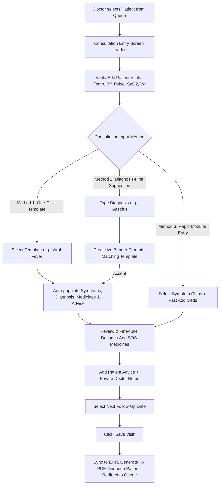
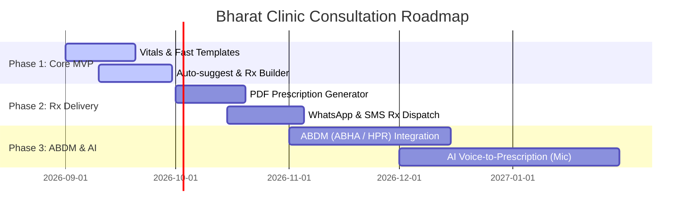

# Product Requirements Document (PRD)
## Bharat Clinic — Fast Consultation Entry & E-Prescription Module

---

### Document Information
- **Product Name**: Bharat Clinic (OPD Management & Fast Consultation Suite)
- **Feature Module**: Clinical Consultation Entry & Smart E-Prescription (`/consultation/entry`)
- **Version**: 1.0.0
- **Status**: Ready for Implementation / Baseline Specification
- **Target Release**: Q3 2026
- **Primary Audience**: Engineering, Product Design, Clinical Operations, QA

---

## 1. Executive Summary & Vision

### 1.1 Problem Statement
In high-density outpatient departments (OPDs) and private clinics across India, general practitioners (GPs) and specialists consult between **40 to 100+ patients per day**, spending merely **2 to 4 minutes per patient**. Existing Electronic Health Record (EHR) systems are bloated, requiring 15–20 clicks, excessive dropdown selections, and rigid forms that slow doctors down, resulting in:
- High abandonment of digital prescription software back to illegible handwritten paper slips.
- Inaccurate dosage / timing records due to haste.
- Receptionists and doctors operating in disconnected silos.

### 1.2 Product Vision
The **Consultation Entry Module** is engineered as a **sub-60-second, frictionless clinical encounter logger**. It empowers doctors to review vitals, log symptoms, input diagnoses, apply one-tap standardized prescription templates, customize dosages with smart auto-suggest, and finalize the patient visit in **under 60 seconds with minimal keystrokes**.

---

## 2. Target Personas

| Persona | Role & Context | Pain Points & Needs |
| :--- | :--- | :--- |
| **Dr. Ananya Sharma** (Primary User) | Senior General Physician consulting 60+ patients/day in a semi-urban clinic. | Needs zero typing friction, instant pre-filled templates for acute conditions (e.g., viral fever, gastritis), and single-click submit. |
| **Suresh Kumar** (Secondary User) | Clinic Receptionist / Compounder managing token queues & initial vitals check-in. | Needs real-time syncing of captured vitals (BP, SpO2, Temp) to the doctor's screen without re-entry. |
| **Rajesh Patil** (End Beneficiary) | Patient visiting for acute fever and cough. | Needs a clean, legible, printed/WhatsApp digital prescription with explicit dosage timings (e.g., *After Food, Morning-Night*). |
| **Clinic Administrator** | Oversees clinic operations, inventory, and compliance. | Requires standardized medication logs, ABDM readiness, and secure data storage. |

---

## 3. Goals & Success Metrics (KPIs)

### 3.1 Primary Objectives
1. **Speed & Efficiency**: Reduce average consultation logging time to **< 45 seconds** when using templates and **< 75 seconds** for custom prescriptions.
2. **Click & Keystroke Optimization**: Complete 80% of routine acute consultations with **< 6 interactions** (touch/clicks).
3. **Zero Data Loss**: Instant optimistic UI persistence with automatic offline resilience.

### 3.2 Key Performance Indicators (KPIs)
- **Consultation Turnaround Time (TAT)**: Target median < 50s.
- **Template Utilization Rate**: > 65% of acute cases logged via quick templates.
- **Auto-Suggest Acceptance Rate**: > 80% selection from the first 3 medicine recommendations.
- **Doctor Satisfaction Score (CSAT)**: ≥ 4.8 / 5.0 for clinical workflow speed.

---

## 4. User Journey & Workflow



---

## 5. Functional Requirements & Feature Specifications

### 5.1 Patient Header & Context Banner
- **Patient Identifier**: Displays patient full name, token number, age, gender, and consultation type.
- **Navigation**: Back button returning to Patient Profile (`/patient/:id`) or Queue (`/doctor/queue`) with uncommitted changes warning.
- **Quick Actions**: Overflow menu with options for *View Past Encounters*, *Medical History / Allergies*, *Print Blank Rx*, and *Cancel Encounter*.

### 5.2 Real-time Editable Vitals Strip
- **Parameters Supported**:
  - Temperature (°F) — with rapid preset buttons (`98.6°`, `99°`, `100°`, `101°`, `102°`, `103°`, `104°`).
  - Blood Pressure (mmHg) — formatted as `SYS/DIA` (e.g. `120/80`).
  - Pulse Rate (bpm).
  - Blood Oxygen (SpO2 %).
  - Body Weight (kg).
- **Clinical Alert Styling**:
  - High fever (≥ 100.0°F) highlighted in warning/error red border and text.
  - Low SpO2 (< 95%) triggers critical alert coloring.
- **Input UX**: One-tap select-all on focus (`onFocus={e => e.target.select()}`) to replace values in one keystroke.

### 5.3 One-Click Prescription Templates (Fast Rx Engine)
- **Pre-configured Clinical Bundles**:
  1. **Viral Fever**: Paracetamol 650mg, Cetirizine 10mg, B-Complex, Vitamin C 500mg.
  2. **Common Cold**: Cetirizine 10mg, Paracetamol 500mg, Dextromethorphan Syrup, Xylometazoline Drops.
  3. **Gastritis / Acidity**: Pantoprazole 40mg, Domperidone 10mg, Ranitidine 150mg.
  4. **Urinary Tract Infection (UTI)**: Ciprofloxacin 500mg, Paracetamol 500mg, Pantoprazole 40mg.
  5. **Acute Diarrhea / Gastroenteritis**: ORS Sachet, Metronidazole 400mg, Ondansetron 4mg, Zinc 20mg.
  6. **Musculoskeletal Sprain / Body Pain**: Aceclofenac 100mg, Pantoprazole 40mg, Diclofenac Gel.
- **Behavior**:
  - Selecting a template populates diagnosis, symptom pills, multi-drug prescription table, and standardized patient lifestyle advice.
  - Active template chip indicates active state with visual indicator badge.

### 5.4 Symptoms Selector & Custom Tagging
- **Default Chips**: Instant toggle chips for common complaints (*Fever, Cough, Cold, Headache, Body pain, Vomiting, Diarrhea, Fatigue*).
- **Custom Symptom Addition**: Inline input field allows entering ad-hoc symptoms, automatically appending them as selected pills.
- **Deduplication**: Case-insensitive deduplication against existing symptom catalog.

### 5.5 Predictive Diagnosis Engine
- **Free-text Diagnosis Input**: Fast text box with predictive lookup.
- **Dynamic Template Suggestion**:
  - When typing a diagnosis (e.g., "gastro" or "fever"), an intelligent prompt banner appears proposing the corresponding pre-filled protocol.
  - Single-click "Apply" button triggers full protocol auto-fill.

### 5.6 Medicine Builder & Auto-Suggest
- **Frequently Used Medicines (One-Tap Quick Add)**:
  - Top 6 frequently prescribed items displayed as clickable pill badges (*Paracetamol 650mg, Cetirizine 10mg, Pantoprazole 40mg, Azithromycin 500mg, B-Complex, Vitamin C*).
  - Tapping a badge adds it to the active prescription table immediately.
  - Badges for already-added drugs are disabled and marked with a checkmark.
- **Auto-Suggest Search Catalog**:
  - Searching triggered after ≥ 2 characters.
  - Dropdown displays matching drug name and form type (Tablet, Capsule, Syrup, Drops, Inhaler, Ointment, Injection).
- **Prescription Form Fields**:
  - **Type**: Tablet | Capsule | Syrup | Injection | Drops | Ointment | Inhaler.
  - **Dosage Code**: Standardized Indian clinic format (`1-0-0`, `0-1-0`, `0-0-1`, `1-0-1`, `0-1-1`, `1-1-0`, `1-1-1`, `1-1-1-1`, `SOS`).
  - **Meal Timing**: `Before Food`, `After Food`, `With Food`, `Empty Stomach`, `At Bedtime`.
  - **Duration**: Numerical input with `Days` label (defaults to 3, 5, or 7 days).
- **Medicine Item Management**:
  - Reorder, remove, or modify dose/timing directly within the active item card.

### 5.7 Patient Instructions & Internal Clinical Notes
- **Advice / Patient Instructions**: Printed on the physical Rx & included in WhatsApp delivery (e.g., dietary restrictions, hydration guidance, steam inhalation).
- **Doctor Notes (Internal Only)**: Encrypted internal clinical observations (differential diagnosis, confidential patient remarks) explicitly flagged with a privacy lock icon and excluded from the patient-facing printout.

### 5.8 Follow-up Scheduler & Visit Finalization
- **Next Follow-up Date**: Native date selector or quick-day presets (+3 Days, +1 Week, +2 Weeks).
- **Primary CTA ("Save Visit")**:
  - Triggers client validation.
  - Displays affirmative feedback toast.
  - Transitions patient state from `IN_CONSULTATION` to `COMPLETED`.
  - Generates prescription record and redirects doctor to the updated Queue screen.

---

## 6. Data Model & Schema Specifications

```typescript
export interface VitalSigns {
  temperatureFahrenheit: number;
  bloodPressureSys: number;
  bloodPressureDia: number;
  pulseBpm: number;
  spo2Percentage: number;
  weightKg: number;
  recordedAt: string; // ISO 8601
}

export type MedicationType = 
  | 'Tablet' 
  | 'Capsule' 
  | 'Syrup' 
  | 'Injection' 
  | 'Drops' 
  | 'Ointment' 
  | 'Inhaler';

export type DoseFrequency = 
  | '1-0-0' 
  | '0-1-0' 
  | '0-0-1' 
  | '1-0-1' 
  | '0-1-1' 
  | '1-1-0' 
  | '1-1-1' 
  | '1-1-1-1' 
  | 'SOS';

export type MealTiming = 
  | 'Before Food' 
  | 'After Food' 
  | 'With Food' 
  | 'Empty Stomach' 
  | 'At Bedtime';

export interface PrescribedMedicine {
  id?: string;
  name: string;
  type: MedicationType;
  dose: DoseFrequency;
  timing: MealTiming;
  durationDays: number;
  instructions?: string;
}

export interface ConsultationRecord {
  id: string;
  clinicId: string;
  patientId: string;
  doctorId: string;
  visitDate: string; // ISO 8601
  status: 'DRAFT' | 'COMPLETED' | 'CANCELLED';
  vitals: VitalSigns;
  symptoms: string[];
  diagnosis: string;
  appliedTemplateId?: string | null;
  prescriptions: PrescribedMedicine[];
  patientAdvice: string;
  privateDoctorNotes: string;
  followUpDate?: string | null;
  createdAt: string;
  updatedAt: string;
}
```

---

## 7. Non-Functional Requirements (NFRs)

### 7.1 Performance & Latency
- **Page Load Time**: Initial interactive render in **< 1.0 second** over 4G connections.
- **Typing & Search Debounce**: Medicine search auto-suggest query response in **< 50ms** using client-side indexing.
- **Save Operation**: Optimistic UI transition under **200ms** with background sync.

### 7.2 Usability & Ergonomics
- **Touch Target Size**: Minimum 44px x 44px (`h-touch-target`) for all buttons, inputs, and chips to guarantee smooth tablet/mobile usage.
- **Keyboard Shortcuts**:
  - `Ctrl/Cmd + S`: Save Visit
  - `Ctrl/Cmd + T`: Focus Template Selection
  - `Ctrl/Cmd + M`: Focus Medicine Auto-suggest
  - `Tab / Shift+Tab`: Smooth linear tab index traversal across all input rows.

### 7.3 Design Tokens & Theming
- Built on Material 3 design tokens (`bg-surface`, `text-primary`, `bg-primary-container`, `border-outline-variant`).
- High-contrast visual hierarchy designed for diverse clinic lighting conditions (bright sunlight / fluorescent lamps).

### 7.4 Security, Privacy & Compliance
- **Patient Privacy**: Doctor's internal clinical notes must be physically isolated from exported PDF/WhatsApp payloads.
- **Data Protection**: End-to-end HTTPS/TLS 1.3 encryption for all clinical records in transit; AES-256 for data at rest.
- **DISHA & ABDM Alignment**: Ready for Ayushman Bharat Digital Mission (ABDM) Milestone 1 (ABHA creation) and Milestone 2/3 (Health Information Exchange - Teleconsultation & Prescription sharing).

---

## 8. Edge Cases & Error Handling

| Scenario | System Handling / Expected Behavior |
| :--- | :--- |
| **Abnormal Vitals Entry** (e.g., Temp = 106°F or SpO2 = 88%) | Input field renders error border color; optional modal confirmation warning doctor of critical vitals before saving. |
| **Duplicate Medicine Addition** | System blocks identical drug addition, triggers an informative toast notice: `"[Med Name] already in prescription"`. |
| **Unsaved Page Navigation** | Browser `beforeunload` interceptor prompts: *"You have unsaved clinical entries. Discard changes?"* |
| **Network Failure during Save** | Record is cached in IndexedDB/LocalStorage, flagged as `PENDING_SYNC`, and re-synced automatically upon reconnection. |
| **Zero Medicine Consultation** | Allowed (e.g., lifestyle counseling, observation, or referral visits without medication). |

---

## 9. Release Phases & Product Roadmap



- **Phase 1 (Current MVP)**: High-speed consultation entry UI, 6 clinical templates, medicine catalog search, responsive layout, and state transition.
- **Phase 2 (Print & Digital Delivery)**: Thermal & A4 prescription PDF generator with clinic header, one-click WhatsApp Rx PDF link dispatch to patient phone.
- **Phase 3 (ABDM Compliance)**: Linking patient ABHA ID, digitally signed prescriptions via Doctor HPR ID.
- **Phase 4 (AI Clinical Assistant)**: Ambient voice-to-Rx dictation (Hindi, Marathi, English) parsing complaints, diagnoses, and medicines in real-time.

---

## 10. Acceptance Criteria (Definition of Done)

1. [x] Doctor can view and modify pre-populated vitals with single-touch interaction.
2. [x] Selecting any Quick Template populates diagnosis, symptom pills, medication items, and advice in < 100ms.
3. [x] Typing a diagnosis displays the relevant template suggestion chip.
4. [x] Searching medicines displays typed results matching brand and generic database.
5. [x] Tapping frequently used drug pills adds them to the prescription table immediately.
6. [x] Doctor can remove any medicine with a single tap.
7. [x] Differentiating between patient-facing advice and internal doctor notes is strictly enforced.
8. [x] Clicking "Save Visit" displays confirmation toast and successfully transitions to the Doctor Queue.
